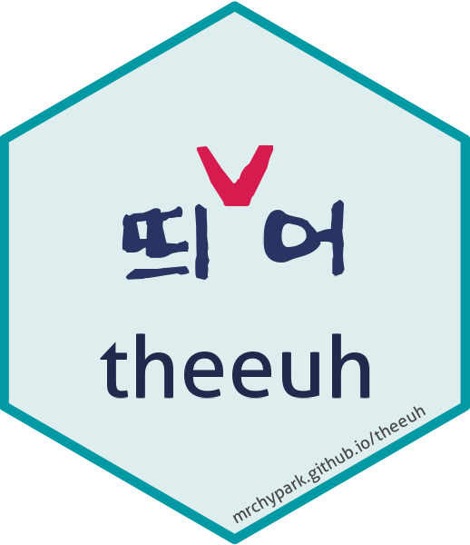

# theeuh [](https://mrchypark.github.io/theeuh/index.html)

<!-- badges: start -->
[](https://lifecycle.r-lib.org/articles/stages.html#stable)
[](https://github.com/mrchypark/theeuh/actions)
[](https://CRAN.R-project.org/package=theeuh)
[](https://mrchypark.r-universe.dev/)
[](https://mrchypark.r-universe.dev/ui#packages)
[](https://cran.r-project.org/package=theeuh)
[](https://cran.rstudio.com/package=theeuh)
[](https://app.codecov.io/gh/mrchypark/theeuh?branch=main)
<!-- badges: end -->

# [한글문서](https://mrchypark.github.io/theeuh/articles/readme-kr.html)

The goal of theeuh is to write space on korean sentense corractly.

## Installation

`{theeuh}` depends on `{churon}` package which handles ONNX runtime automatically.

``` r
# CRAN NOT YET!!!!
install.packages("theeuh")

# dev version r-universe
install.packages('theeuh', repos = "https://mrchypark.r-universe.dev")
```

## Usage

Please check <https://mrchypark.github.io/theeuh>

## Special Thanks to

Original package is [KoSpacing](https://github.com/haven-jeon/KoSpacing) by [haven-jeon](https://github.com/haven-jeon).
Most parts of code is from [KoSpacing](https://github.com/haven-jeon/KoSpacing)
Also `{theeuh}` package's model and word index is from [KoSpacing](https://github.com/haven-jeon/KoSpacing).

